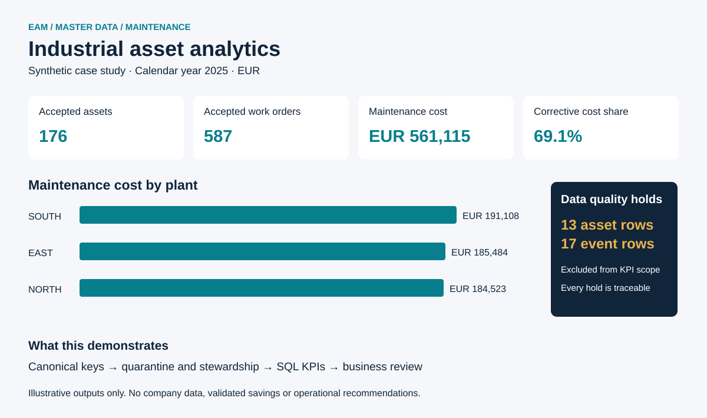

# Industrial Asset Data Analytics

**A synthetic EAM case study: make asset master data trustworthy, then turn maintenance records into defensible business measures.**

  



This portfolio project connects my Electrical Engineering background and three years of EAM, master-data and data-quality experience with my MSc in Technology-Based Business Development and interest in Python, SQL and Power BI. It demonstrates how I would structure a data-quality investigation, explain the limits of a KPI and translate findings into a maintenance-planning discussion.

**All equipment, plants, manufacturers, maintenance events and costs are fictional.** This is an independent portfolio demonstration. It does not use confidential employer, client, university or municipality data, and it claims no real deployment or quantified operational impact.

## The business problem

A maintenance team wants to identify recurring failures and understand spending across three plants. Asset records contain inconsistent keys, duplicate entries, missing manufacturers and conflicting criticality values. Joining these records directly to work orders can multiply costs, hide unmatched events and produce misleading asset counts.

The project first creates an auditable accepted master. It then analyzes only work orders that pass validity checks and match that master. Records requiring judgment are retained in quarantine for a data steward; they are never silently guessed or discarded.

## Explore the result

| 2025 synthetic scenario | Result |
|---|---:|
| Raw asset rows → accepted unique assets | 189 → 176 |
| Raw work-order rows → accepted work orders | 604 → 587 |
| Accepted maintenance cost | EUR 561,115.14 |
| Simulated failures | 190 |
| Corrective share of accepted cost | 69.09% |
| Accepted assets needing manufacturer enrichment | 11 |

The 13 held master rows include four redundant exact duplicates, four rows representing two conflicting keys, three missing keys and two invalid records. All 17 held work orders remain available for reconciliation. Ten accepted assets have no accepted maintenance events and remain in the asset denominator.

Start with the [business insights](results/business_insights.md), [plant comparison](results/plant_kpis.csv), [asset-level KPIs](results/asset_kpis.csv) and [quality issue register](results/data_quality_issues.csv). Numbers above are illustrative scenario outputs, not evidence of business impact.

## Reproduce in one command

Requires **Python 3.11 or newer**. The analysis uses Python's standard library and SQLite; no package installation, account, API key or paid service is needed.

```bash
git clone https://github.com/Monish-1010/industrial-asset-data-analytics.git
cd industrial-asset-data-analytics
python run.py
python -m unittest discover -s tests -v
```

Run `python` or `python3` according to your system. The fixed seed `20260923` and calendar-year 2025 window make outputs repeatable. Rerunning replaces this project's generated raw, processed and result files; do not place external data in those folders. `requirements.txt` documents the zero-dependency setup.

The pipeline creates a local `results/analytics.sqlite` database for exploration. It is ignored by Git; the SQL and CSV outputs are committed. Query the database using your preferred SQLite client:

```sql
SELECT equipment_id, criticality, failure_count, maintenance_cost_eur
FROM asset_kpis
WHERE criticality = 'A' AND failure_count >= 2
ORDER BY failure_count DESC, maintenance_cost_eur DESC;
```

## What the project demonstrates

1. **Controlled master-data cleaning:** trim and standardize known formats, validate domains and dates, deduplicate canonical records, and hold every version of a conflicting key.
2. **Quality controls and stewardship:** row-level issues, explicit dispositions, missing-value visibility and an actionable resolution process.
3. **SQL analysis:** primary/foreign keys, left joins, conditional aggregation, cost-per-asset measures and zero-event asset preservation.
4. **Maintenance interpretation:** repeat failures, corrective spending, repair-duration proxies, plant comparisons and denominator-aware reporting.
5. **Power BI handoff:** a star-schema design, DAX measures, layout guidance and reconciliation checks, plus an exported SVG overview.

See [data definitions and KPI formulas](docs/data-dictionary.md), [quality rules and stewardship](docs/data-quality-workflow.md), [Power BI dashboard specification](docs/power-bi-dashboard.md) and [data provenance and assumptions](docs/data-provenance.md). A `.pbix` file is not included; the CSVs and specification make the dashboard reproducible without pretending that a native Power BI artifact was generated.

## Structure

```text
run.py                    Rebuild all data, measures and figures
src/pipeline.py           Generation, cleaning, issue register and reporting
sql/analysis.sql          Schema and reusable analytic views
data/raw/                 Deliberately imperfect synthetic source tables
data/processed/           Accepted and quarantined tables
results/                  CSV measures, issue register and written findings
images/                   Portable SVG dashboard overview
docs/                     Definitions, provenance and Power BI handoff
tests/                    Integrity, edge-case and reproducibility checks
```

## Interpret with care

The generator deliberately gives compressors a higher failure probability. The fleet is assumed in scope throughout 2025, but operating hours are not simulated. Failure frequency is expressed per 100 **asset-years**, not operating hours; it can exceed 100 because assets can fail more than once. Mean corrective downtime is an event-level repair-duration proxy. The data cannot establish availability, validated MTBF, causality, true maintenance effectiveness or savings.

Accepted-only totals exclude unresolved records. A production handoff would reconcile excluded costs, verify source-system ownership and obtain approval for master-data corrections before using these measures operationally.

## Portfolio

Created by [Monish-1010](https://github.com/Monish-1010) for student opportunities in data analytics, digitalization, EAM/master data, renewable energy and technology-based business development.

**License:** [MIT](LICENSE), including the generated synthetic data.
